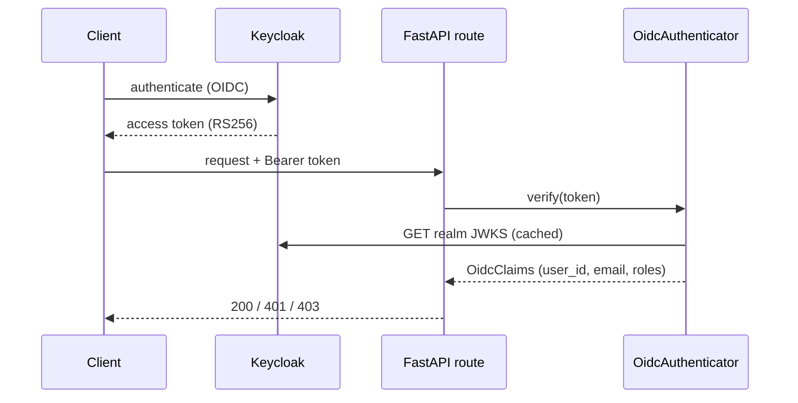

# Auth & RBAC (Keycloak)

Authentication and role-based access control are provided by **Keycloak** via OIDC. The API is a
resource server: it verifies access tokens but never handles passwords.

## Token verification

`OidcAuthenticator` (`contexts/users/infrastructure/auth/oidc.py`) verifies an OIDC access
token:

- **Signature** — RS256, checked against the realm's published **JWKS** (fetched from
  `{KEYCLOAK_URL}/realms/{REALM}/protocol/openid-connect/certs` and cached for 1 hour).
- **Issuer** — must equal `{KEYCLOAK_URL}/realms/{REALM}`.
- **Expiry** — enforced by the JWT decode; **audience** is optional (`verify_audience`).

On success it extracts `OidcClaims`: `sub → user_id` (UUID), `email` (or `preferred_username`),
and roles from `realm_access.roles` **and/or** `cognito:groups` (lower-cased). It is framework-free —
it raises the shared `AuthenticationError` and knows nothing about HTTP.

!!! note "IdP-agnostic (Cognito-compatible)"
    The issuer/JWKS URLs above are the **defaults derived from the Keycloak settings**. Setting
    `OIDC_ISSUER`, `OIDC_JWKS_URL`, and `OIDC_CLIENT_ID` overrides them, so the same verifier works
    against AWS Cognito (whose issuer is `https://cognito-idp.<region>.amazonaws.com/<pool>` and whose
    roles arrive in the `cognito:groups` claim) — this is what the
    [AWS stack](../operations/infrastructure.md) injects.



## RequestContext and RBAC

`get_request_context` (`presentation/api/dependencies.py`) turns the verified claims into a
`RequestContext` (`contexts/shared/application/request_context.py`) — `user_id`, `email`, `roles` —
and binds it to a contextvar via `bind_context` so any downstream code can read the caller.

RBAC is a dependency factory:

```python
_ctx: RequestContext = Depends(require_role("admin"))
```

`require_role("admin")` returns 403 unless `ctx.has_role("admin")`. `POST /users` and
`PATCH /users/{id}/role` are admin-only; reads only require a valid caller.

!!! warning "Dev backdoor (DEBUG only)"
    When `DEBUG=true` **and** no Bearer token is present, an `X-Dev-Roles` header fabricates a
    `RequestContext` so the API can be exercised locally without Keycloak:

    ```bash
    curl -H 'X-Dev-Roles: admin' localhost:18000/api/v1/users
    ```

    This path is inert in production (`DEBUG=false`).

## The seeded realm

`docker/keycloak/realm-export.json` provisions realm **`ddd`** with client **`ddd-api`** and two
users:

| Username | Password | Realm roles |
| --- | --- | --- |
| `admin-user` | `admin` | `admin`, `member` |
| `member-user` | `member` | `member` |

Domain and auth exceptions map to HTTP in one place (`presentation/api/errors.py`):
`AuthenticationError → 401`, `PermissionDeniedError → 403`. See [Persistence & CQRS](persistence.md)
for how authenticated requests reach the data layer.
