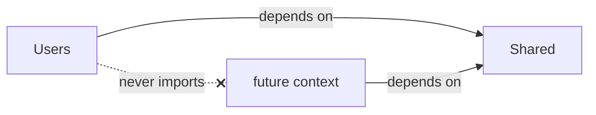

# Bounded Contexts

The project has **exactly two** contexts under `src/ddd_app/contexts/`:

| Context | Kind | Role |
| --- | --- | --- |
| `users` | Business context | The only feature slice: user accounts, registration, roles, Keycloak auth. |
| `shared` | Kernel | Cross-cutting building blocks every context may depend on. |

!!! note "No other contexts"
    There is no `tasks` context, no `ai` context, and no multi-tenancy. `users` is the single
    business context; `shared` is a kernel, not a feature.

## Owning its vertical slice

Each business context is self-contained: it holds its own domain model, use cases, and
infrastructure, plus a DI container that wires them. Nothing about a user leaks out except through
a published contract.

```text
contexts/users/
├── domain/          # User entity, repository port, domain services, exceptions
├── application/     # commands/ (writes), queries/ (reads), dto/
├── infrastructure/  # SQLAlchemy repo + models + mappers, Keycloak authenticator
└── container.py     # UsersContainer: wires the slice together
```

The `shared` kernel has the same internal shape where relevant:

```text
contexts/shared/
├── domain/          # DomainError family (framework-free exceptions)
├── application/     # RequestContext, Page
├── infrastructure/  # db/ (Database, scoped session, BaseModel), cache/ (RedisCache)
├── contracts.py     # cross-context ABCs + DTOs (UserDirectory, UserRef)
└── container.py     # SharedContainer: Database, Redis, RedisCache singletons
```

## Isolation rules



!!! warning "Contexts never import each other"
    A context may depend on `shared`, but **never** on a sibling context's modules. When one
    context needs data from another, it goes through a contract in
    [`shared.contracts`](contracts.md), implemented by an adapter at the composition root. This
    keeps the dependency graph a tree (contexts → shared), never a web.

Because `users` is currently the only business context, it *publishes* the `UserDirectory`
contract for future consumers but has no sibling to consume from yet.

See [Layering](layering.md) for the intra-context dependency rule and how `import-linter`
enforces both isolation and layering.
