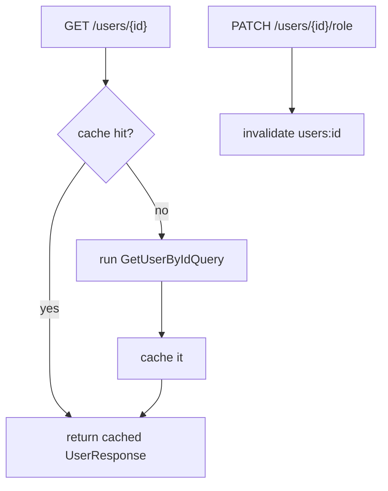

# Caching (Redis)

Reads that would otherwise hit Postgres on every call are served through a small, namespaced Redis
cache living in the shared kernel.

## RedisCache

`RedisCache` (`contexts/shared/infrastructure/cache/redis_cache.py`) stores keys as
`<namespace>:<key>`. It is a `SharedContainer` singleton alongside the Redis client.

- **Namespace allow-list** — namespaces are validated against `CACHE_NAMESPACES` (default `users`),
  so a typo can't silently write to an unmanaged keyspace.
- **Global enable flag** — when `CACHE_ENABLE` is off, every operation is a no-op and `get` returns
  `None`. Caching can be turned off entirely without touching call sites.
- **Operations** — `get`, `set` (with TTL, default 300s), `invalidate`, plus `ping`/`close`.

## Read-through helper

`cached()` (`presentation/api/caching.py`) is a typed read-through wrapper over `RedisCache`:

```python
async def cached[M: BaseModel](cache, namespace, key, model, produce, *, ttl=300) -> M:
    hit = await cache.get(namespace, key)
    if hit is not None:
        return model.model_validate_json(hit)
    value = await produce()
    await cache.set(namespace, key, value.model_dump_json(), ttl=ttl)
    return value
```

It serializes Pydantic response models to/from JSON, so the cache stores response DTOs, never ORM
rows.

## Cache-aside on the users routes



- `GET /api/v1/users/{id}` is served through `cached()` in namespace `users`.
- `PATCH /api/v1/users/{id}/role` calls `cache.invalidate("users", id)` after the write so a role
  change never serves stale data.

!!! note "Redis also backs rate limiting"
    The same Redis instance powers the `RateLimitMiddleware` (fixed-window `INCR`/`EXPIRE` per
    client IP). That middleware **fails open** — if Redis is down the request still proceeds — so a
    cache outage never takes the API down. See [Docker Stack](../operations/docker.md) for the
    Redis service and [Auth & RBAC](auth-rbac.md) for the request pipeline.
