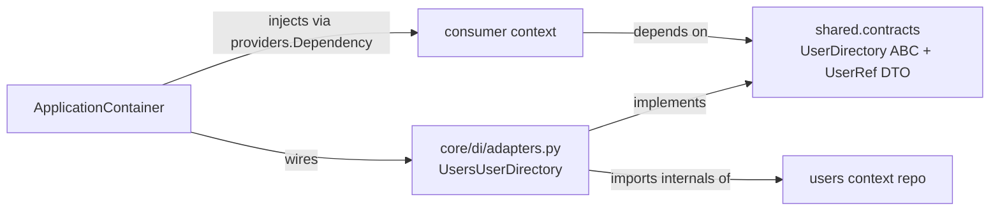

# Cross-Context Contracts

Bounded contexts **never import each other**. When one context needs data owned by another, it goes
through a narrow contract published in the shared kernel and implemented by an adapter at the
composition root.

## The three roles



1. **`shared/contracts.py`** declares a narrow ABC plus its own small DTOs. The current example:

    ```python
    @dataclass(frozen=True, slots=True)
    class UserRef:
        id: UUID
        email: str
        is_active: bool

    class UserDirectory(ABC):
        async def find(self, user_id: UUID) -> UserRef | None: ...
        async def exists(self, user_id: UUID) -> bool: ...
    ```

2. **The adapter** at `core/di/adapters.py` implements the contract using the provider context's
   repository, translating its entity into the contract's DTO. `UsersUserDirectory` takes a
   *repository factory* so each call binds to the current request session.

3. **The consumer** depends only on `ddd_app.contexts.shared.contracts` — never on the provider's
   modules.

!!! info "The one allowed exception"
    `core/di/adapters.py` is the **only** place permitted to import a context's internals. It is
    not a context; it is the composition root, whose job is precisely to bridge them.

## Wiring at the root

The adapter is registered in the `ApplicationContainer` (`core/di/container.py`):

```python
user_directory = providers.Factory(
    UsersUserDirectory,
    user_repository_factory=users.user_repository.provider,
)
```

A consumer context would declare `providers.Dependency()` in its own container and receive
`user_directory` from the root — so the consumer sees only the ABC, never `users`.

!!! note "Why this matters"
    The dependency graph stays a tree: every context points at `shared`, never at a sibling. Since
    `users` is the only business context today, it *publishes* `UserDirectory` for future consumers
    but nothing consumes it yet.

See [Bounded Contexts](bounded-contexts.md) for the isolation rule and [Layering](layering.md) for
the intra-context direction.
