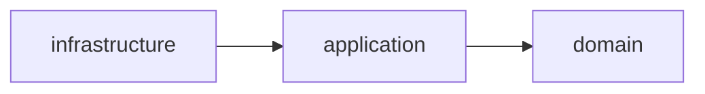
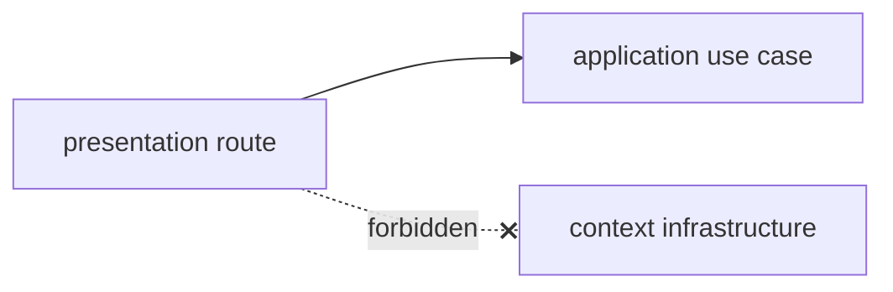

# Layering

Inside every context the dependency direction is strict and one-way:

`infrastructure → application → domain` — arrows point *inward*. An inner layer never knows about
an outer one.

## Why direction matters

- **`domain`** holds the model and rules (`User` entity, repository *port*, domain services). It is
  **framework-free**: no `fastapi`, `sqlalchemy`, `redis`, `jose`, or `dependency_injector`
  imports. This keeps business rules testable in isolation and immune to library churn.
- **`application`** orchestrates domain objects into use cases (commands/queries) and speaks in
  DTOs. It depends on domain ports, not concrete adapters.
- **`infrastructure`** implements the ports (SQLAlchemy repository, Keycloak authenticator). It is
  the only layer that touches external systems.

`container.py` sits alongside the layers as the context's **composition root** — the one place that
imports concrete infrastructure and wires it to application use cases via `providers.Factory`.

## Presentation purity

Routes call **application** use cases only; serializers map to/from application DTOs, never ORM
models. Presentation must not reach into a context's `infrastructure` package directly.

## Enforced by import-linter

The rules above are not conventions — they are checked in CI via `import-linter` contracts declared
in `pyproject.toml` (run with `task check:architecture`). The four contracts:

| Contract | Type | What it guarantees |
| --- | --- | --- |
| Shared context layering | `layers` | `infrastructure → application → domain` within `contexts.shared`. |
| Users context layering | `layers` | Same ordering within `contexts.users`. |
| Domain layers are framework-free | `forbidden` | `*.domain` may not import `fastapi`, `sqlalchemy`, `redis`, `jose`, `dependency_injector`. |
| Presentation depends on application, not infrastructure | `forbidden` | `presentation` may not import `contexts.users.infrastructure`. |

!!! tip
    The architecture test at `tests/architecture/test_boundaries.py` runs `import-linter` as part
    of the normal pytest suite, so a boundary violation fails the build. See
    [Testing](../development/testing.md).

Cross-*context* isolation (contexts never importing each other) is handled by the contract
mechanism in [Cross-Context Contracts](contracts.md).
