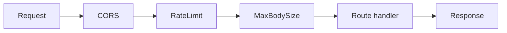

# Middleware

Two cross-cutting middlewares wrap every request, in `presentation/api/middleware/`. They are added
in `create_app()` and — because Starlette runs middleware **outermost-first** (reverse order of
addition) — the effective order is:



CORS is outermost (so preflight and headers apply to everything, including rejections); the rate
limiter runs before the body is read; the body-size cap runs just before the route.

## Rate limiting — `RateLimitMiddleware`

A **Redis fixed-window** counter per client IP: `INCR ratelimit:<ip>` with `EXPIRE` on the first hit
of a window. Over the limit → **HTTP 429**.

- **Fails open**: if Redis is unreachable, the request proceeds rather than erroring — a cache outage
  never takes the API down.
- **Exempt paths**: `/`, `/health`, `/docs`, `/redoc`, `/openapi.json` are never limited.
- Uses the same Redis client as the cache (a `SharedContainer` singleton).

```python
# effective config (settings)
RATE_LIMIT_ENABLED=true        # set false to disable entirely
RATE_LIMIT_REQUESTS=100        # allowed requests per window per IP
RATE_LIMIT_WINDOW_SECONDS=60   # window length
```

## Request body size cap — `MaxBodySizeMiddleware`

Rejects over-large uploads with **HTTP 413** by checking the `Content-Length` header up front, before
the body is read into memory. Requests without a declared length pass through.

```python
MAX_REQUEST_BODY_BYTES=1048576   # 1 MiB default
```

## Where it fits

- Both are plain Starlette `BaseHTTPMiddleware` classes — no business logic, no DB.
- They're wired in `presentation/api/app.py`; settings come from `core/config.py` (`Settings`).
- Rate limiting shares Redis with the [cache](caching.md); see [Persistence & CQRS](persistence.md)
  for how the rest of the request pipeline (session, transactions) works, and
  [Auth & RBAC](auth-rbac.md) for how the caller is authenticated after these middlewares.

## Testing

Both are unit-tested in isolation (`tests/unit/test_middleware.py`) with a tiny app and an in-process
fake Redis — covering the limit boundary (200 → 200 → 429), exempt paths, the disabled no-op, the
**fail-open** path when Redis raises, and the 413 body-size cap. No external services are required
(see [Testing](../development/testing.md)).
