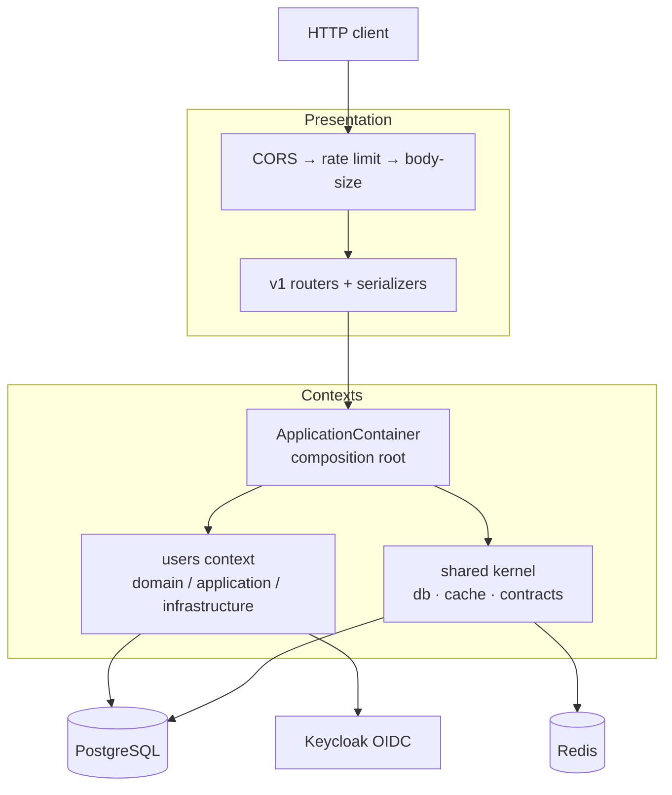

# Architecture Overview

A **modular monolith**: a single deployable FastAPI application, internally split into
independent bounded contexts that talk only through a shared kernel. It keeps the useful
structural discipline of DDD while deliberately dropping the heavyweight tactical patterns.

!!! abstract "Design philosophy — simple on purpose"
    - **Entities only** — the `User` entity is a plain dataclass of primitives (`UUID`, `str`,
      `bool`) with behaviour methods. No value objects, no aggregate roots, no domain events.
    - **CQRS, no Unit of Work** — writes are commands, reads are queries, each a class with one
      `async execute(...)`. Transactions are opened explicitly on write routes.
    - **Contracts live in `shared`** — contexts never import each other; they depend only on
      `contexts/shared/contracts.py`.
    - **Single-tenant** — no `tenant_id`, no row-level security.

## Three structural tiers

| Tier | Location | Responsibility |
| --- | --- | --- |
| `contexts/` | `ddd_app/contexts/` | The bounded contexts (`users` + `shared`), each owning its full vertical slice (domain → application → infrastructure). |
| `presentation/` | `ddd_app/presentation/` | The HTTP transport: FastAPI app, routers, serializers, middleware, dependencies, error mapping. |
| `core/` | `ddd_app/core/` | Composition root: DI containers, config, cross-context adapters, logging. |

## System at a glance

The `ApplicationContainer` nests one container per context (`SharedContainer`, `UsersContainer`)
and wires the cross-context adapter. Config flows in as a flat dict via
`Settings.as_provider_dict()`.

## Where to go next

- [Bounded Contexts](bounded-contexts.md) — the two contexts and what "owns its slice" means.
- [Layering](layering.md) — the `domain → application → infrastructure` rule and its enforcement.
- [Cross-Context Contracts](contracts.md) — how contexts talk without importing each other.
- [Persistence & CQRS](persistence.md) — async sessions and explicit transactions.
- [Auth & RBAC](auth-rbac.md) — Keycloak OIDC and `require_role`.
- [Caching](caching.md) — the namespaced Redis cache.
- Development: [Setup](../development/setup.md) · [Testing](../development/testing.md) ·
  [Governance](../development/governance.md).
