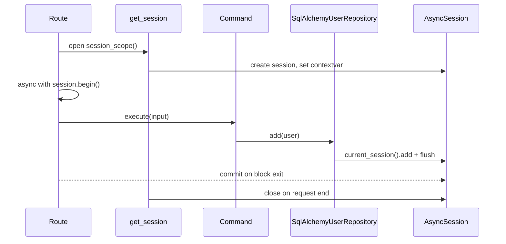

# Persistence & CQRS

Persistence is fully asynchronous SQLAlchemy 2.0 over PostgreSQL (`asyncpg`), with a deliberately
minimal session model: **CQRS with no Unit of Work**.

## Engine and sessions

`Database` (`contexts/shared/infrastructure/db/session.py`) owns the async engine and a
`async_sessionmaker` (`expire_on_commit=False`). It is a `SharedContainer` singleton built from
`database_dsn` (`postgresql+asyncpg://…`).

`session_scope()` opens **one** `AsyncSession` per request and publishes it on a **scoped-session
contextvar** (`db/scoped_session.py`). It does **not** commit — it just closes the session on exit.

```python
@asynccontextmanager
async def session_scope(self):
    session = self._sessionmaker()
    token = set_current_session(session)
    try:
        yield session
    finally:
        reset_current_session(token)
        await session.close()
```

The `get_session` request dependency (`presentation/api/runtime.py`) drives this per request.
Repositories resolve the active session via `current_session()`, so they take **no** session
argument and stay plain `Factory` providers.

## Commands, queries, and transactions

Use cases live in `application/`: **commands** (`register_user`, `change_user_role`) for writes and
**queries** (`get_user`, `list_users`) for reads. Each is a class with a single `async execute(...)`.

!!! important "Transactions are explicit — and only on writes"
    Write routes wrap the command in `async with session.begin()`; read routes just query. There is
    **no `UnitOfWork` class anywhere** in the codebase.

    ```python
    # write route
    command = container.users.register_user_command()
    async with session.begin():
        result = await command.execute(payload.to_input())

    # read route
    query = container.users.list_users_query()
    page = await query.execute(limit=limit, offset=offset)
    ```

## A write request, end to end



## Repositories, mappers, models

`SqlAlchemyUserRepository` implements the domain `UserRepository` port. Translation between the
`User` **entity** and the `UserModel` ORM row is delegated to `UserMapper` — entities never carry
ORM concerns. All ORM models extend the shared declarative `BaseModel`
(`db/base_model.py`).

## Migrations

Schema is managed by **Atlas** (not Alembic): `migrations/atlas.hcl`, versioned SQL under
`migrations/versions/*_baseline.sql`, integrity tracked in `atlas.sum`. Apply with
`task atlas:migrate` (see [Docker Stack](../operations/docker.md)).

!!! note "SQLite is test-only"
    `Database` detects a `sqlite` DSN and drops the Postgres pool args. Integration tests use
    SQLite; production is always Postgres. See [Testing](../development/testing.md).
