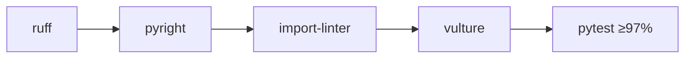

# Governance

Quality is enforced by tooling, not by convention. One command runs the whole gate:

```bash
task check:all
```

## The quality gate

| Tool | Task | Enforces |
| --- | --- | --- |
| **Ruff** | `check:linter` | Lint (`E,F,I,N,UP,B,C4,SIM,RUF`) + format check; **line-length 100**. |
| **Pyright** | `check:types` | Static types in `standard` mode (Python 3.14). |
| **import-linter** | `check:architecture` | The four [layering & isolation contracts](../architecture/layering.md). |
| **Vulture** | `check:deadcode` | Dead-code scan (`min_confidence = 70`). |
| **bandit** | `bandit` | Python SAST over `src/` (part of `check:all`). |
| **pytest** | `test:coverage` | Full suite, parallel + random, with the **≥ 97% coverage gate**. |

`check:all` chains the quality gates (`check:linter → check:types → check:architecture →
check:deadcode → bandit`); tests run separately via `task test:coverage` and the app scan via
`task trivy`. These map to the CI `quality`, `test`, and `trivy` jobs — a single failing check fails
the build. See [CI](../operations/ci.md).



## Design discipline: KISS / YAGNI

The architecture is intentionally minimal. The tooling above protects the *structure*; these
principles protect against *over-engineering*:

!!! abstract "What this project deliberately avoids"
    - **No value objects, no aggregate roots, no domain events** — the `User` entity is a plain
      dataclass of primitives with behaviour methods.
    - **No Unit of Work** — CQRS commands/queries with explicit `session.begin()` on writes only.
    - **No multi-tenancy** — single-tenant, no `tenant_id`, no row-level security.
    - **No inter-context imports** — contexts talk only through
      [`shared.contracts`](../architecture/contracts.md).

!!! tip "Adding a heavyweight pattern is a decision, not a default"
    The point is not that these patterns are wrong — it is that they earn their keep only when the
    domain demands them. Keep new code at the same altitude: entities-only, contracts-in-shared,
    thin presentation. If a change needs a richer pattern, justify it against the existing tests and
    contracts first.

See [Testing](testing.md) for the coverage and architecture checks, and
[Layering](../architecture/layering.md) for the contracts themselves.
