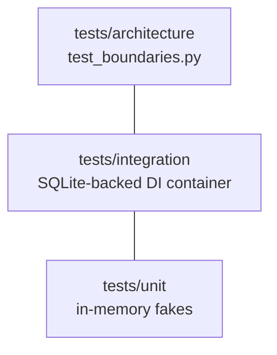

# Testing

Tests live under `tests/` and form a small pyramid:



| Layer | Location | Approach |
| --- | --- | --- |
| Unit | `tests/unit` | Pure use cases and domain, wired against **in-memory fakes** for ports (no DB, no Redis). |
| Integration | `tests/integration` | Real HTTP through a **SQLite-backed DI container** (`tests/conftest.py`, `aiosqlite`). |
| Architecture | `tests/architecture/test_boundaries.py` | Runs `import-linter` so boundary violations fail the suite. |

## How tests run

`addopts` in `pyproject.toml` already applies these on every run:

- **Parallel** — `pytest-xdist` (`-n auto --dist loadscope`); each module stays on one worker.
- **Random order** — `pytest-randomly` reshuffles order each run to surface hidden coupling.
- **Coverage every run** — measured and gated.

```bash
task test:all      # pytest (parallel, random, coverage)
task test:coverage      # + term-missing report
task check:architecture   # just the import-linter contracts
```

!!! important "Coverage gate ≥ 97%"
    `fail_under = 97` in `[tool.coverage.report]`. The suite currently sits around **98.9%**. The
    ASGI bootstrap (`presentation/api/main.py`) and one-shot scripts are omitted from measurement.

## Test doubles and fixtures

!!! note "SQLite is test-only"
    Integration tests build a DI container against an in-memory SQLite database via `aiosqlite`.
    `Database` detects the `sqlite` DSN and skips the Postgres pool arguments. **Production is
    always Postgres** — SQLite never runs outside tests. See
    [Persistence & CQRS](../architecture/persistence.md).

- **Ports are faked** in unit tests (e.g. an in-memory user repository) so use cases run without
  infrastructure.
- **Keycloak** is unit-tested without a live server: the test generates an **RSA key pair**, signs a
  token, and fakes the JWKS endpoint so `KeycloakAuthenticator` verifies against the test key. See
  [Auth & RBAC](../architecture/auth-rbac.md).

Tests run via `task test:coverage` (the CI `test` job); the quality gates run via `task check:all`.
See [Governance](governance.md).
