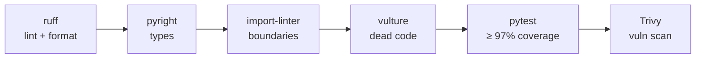

# CI

Continuous integration runs on **GitHub Actions**. Two workflows cover application quality and
infrastructure change review.

## CI — quality gate

On push / pull request, the CI workflow runs the same gate as `task check:all`
(see [Governance](../development/governance.md)), plus a container/dependency vulnerability scan:

| Stage | Tool | Fails the build when… |
| --- | --- | --- |
| Lint & format | Ruff | style / import-order / format issues |
| Types | Pyright | type errors (`standard` mode) |
| Architecture | import-linter | a [layering or isolation contract](../architecture/layering.md) is violated |
| Dead code | Vulture | unused code above the confidence threshold |
| Tests | pytest | any failure, or coverage below the **97% gate** |
| Security | Trivy | known vulnerabilities are found |

!!! note
    The suite runs in parallel and in random order (see [Testing](../development/testing.md)), so CI
    exercises the same configuration developers use locally.

## CD — infrastructure change review

A separate CD workflow reviews infrastructure-as-code changes with **Terraform / Terragrunt**,
targeting a fully serverless AWS deployment. It is parameterized by environment and drives the
`task terragrunt:*` targets (e.g. `task terragrunt:plan ENV=dev`):

1. `task terragrunt:init` + `task terragrunt:plan` (per `ENV`) — produce the change plan.
2. **Trivy** — scan the IaC for misconfigurations.

!!! warning "Deploy and Infracost are disabled for now"
    The pipeline runs plan + Trivy scan for review. The **apply/deploy** step and the **Infracost**
    cost-estimate job are both gated off (`if: false`) — infrastructure is reviewed without being
    provisioned, and cost estimation can be re-enabled by setting `INFRACOST_API_KEY` and removing the
    guard. See the `deploy`/`infracost` job comments in `.github/workflows/cd.yml`.

For the local container stack that CI mirrors, see [Docker Stack](docker.md).
