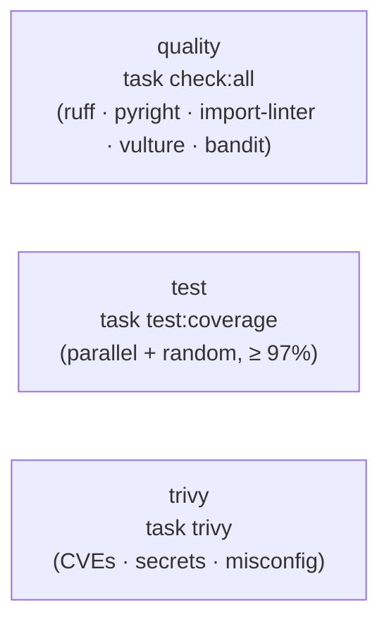

# CI

Continuous integration runs on **GitHub Actions**. Two workflows cover application quality and
infrastructure change review.

## CI — three parallel jobs

On push / pull request, the CI workflow runs three jobs, each driving the same Taskfile targets
developers use locally (see [Governance](../development/governance.md)):

| Job | Target | Fails the build when… |
| --- | --- | --- |
| `quality` | `task check:all` | ruff (incl. `S`/bandit rules), pyright, import-linter, vulture, or bandit finds an issue |
| `test` | `task test:coverage` | any test fails, or coverage drops below the **97% gate** |
| `migrations` | `task atlas:validate` | a migration was changed without re-running `task atlas:hash` (stale/tampered `atlas.sum`) |
| `trivy` | `task trivy` | a dependency CVE, secret, or Dockerfile misconfig is found |

!!! note
    The suite runs in parallel and in random order (see [Testing](../development/testing.md)), and the
    tests use SQLite via the test fixtures — so the `test` job needs no Postgres/Redis services.

## CD — infrastructure change review

A separate CD workflow reviews infrastructure-as-code changes with **Terraform / Terragrunt**,
targeting a fully serverless AWS deployment. It triggers on pushes/PRs touching `infra/**` (and via
`workflow_dispatch` with an `environment` input), and drives the `task terragrunt:*` targets:

1. **`trivy`** — `task terragrunt:trivy` scans the IaC for misconfigurations (runs first).
2. **`plan`** (needs `trivy`) — `task terragrunt:init` + `task terragrunt:plan` per `ENV`. The AWS
   steps run only when the `AWS_DEPLOY_ROLE_ARN` repo variable is set (OIDC); otherwise the job
   reports "skipped", so PRs still get the Trivy gate without needing credentials.

!!! warning "Deploy and Infracost are disabled for now"
    The `deploy` (apply) and `infracost` jobs are both gated off (`if: false`) — infrastructure is
    reviewed without being provisioned. Cost estimation can be re-enabled by setting
    `INFRACOST_API_KEY` and removing the guard. See the job comments in `.github/workflows/cd.yml`.

For the local container stack that CI mirrors, see [Docker Stack](docker.md).
