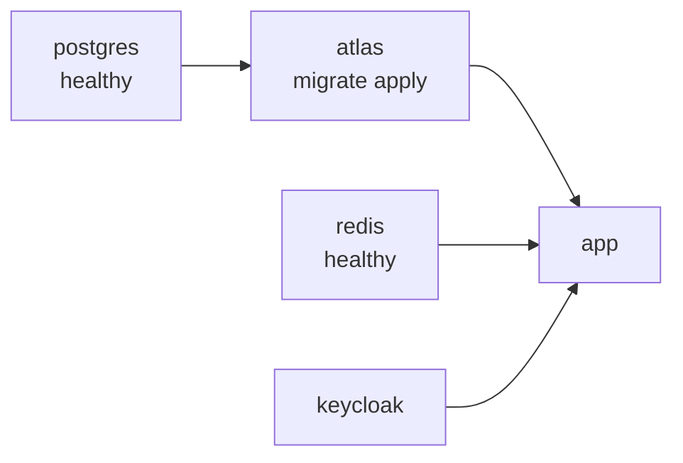

# Docker Stack

The whole system runs from one Compose file, `docker/docker-compose.yml`, on a dedicated bridge
network **`ddd-net`** so every service resolves the others by name and nothing leaks onto the host
default bridge.

## Services

| Service | Image | Port | Role |
| --- | --- | --- | --- |
| `postgres` | `postgres:16` | 5432 | Primary database (`ddd`/`ddd`/`ddd`), health-checked with `pg_isready`. |
| `redis` | `redis:7` | 6379 | Cache + rate-limit store, health-checked with `redis-cli ping`. |
| `keycloak` | `quay.io/keycloak/keycloak:26.0` | 8080 | OIDC provider; imports realm `ddd` on start (`--import-realm`). |
| `atlas` | `arigaio/atlas:latest` | — | **One-shot** migration runner (`restart: "no"`). |
| `app` | multi-stage `Dockerfile` (`dev` target) | 8000 | The FastAPI application. |

The `Dockerfile` is multi-stage with `base`, `builder`, `dev`, and `prod` targets; Compose builds
the `dev` target.

## Configuration

The `app` service reads the project `.env` via `env_file`, then overrides only the host names so it
reaches siblings by service name instead of `localhost`:

```yaml
env_file:
  - ../.env
environment:
  DB_HOST: postgres
  REDIS_HOST: redis
  KEYCLOAK_URL: http://keycloak:8080
```

## Bring-up order

`depends_on` conditions sequence startup so the app never boots against an unmigrated database:



`atlas` waits for Postgres to be **healthy**, applies migrations from
`migrations/versions`, then exits; `app` waits for Postgres + Redis healthy **and** the atlas
migration to have `completed_successfully`.

## Everyday commands

```bash
task docker:up      # up -d --build; API → :8000/docs, Keycloak → :8080
task docker:down    # down -v (removes volumes, keeps images)
task docker:prune   # down -v --rmi local --remove-orphans + drop ddd-net
task docker:logs    # tail the app logs
task docker:smoke   # curl /health
```

`GET /health` pings both Postgres and Redis and returns 503 if either is down.

## Migrations (Atlas)

Beyond the one-shot container, Atlas commands run against the live Postgres via
[Atlas](../architecture/persistence.md):

```bash
task atlas:migrate   # apply pending migrations
task atlas:status    # show migration status
task atlas:hash      # recompute atlas.sum after editing versions
```

See [Setup](../development/setup.md) to get here from a clean checkout, and [CI](ci.md) for the
automated pipeline.
