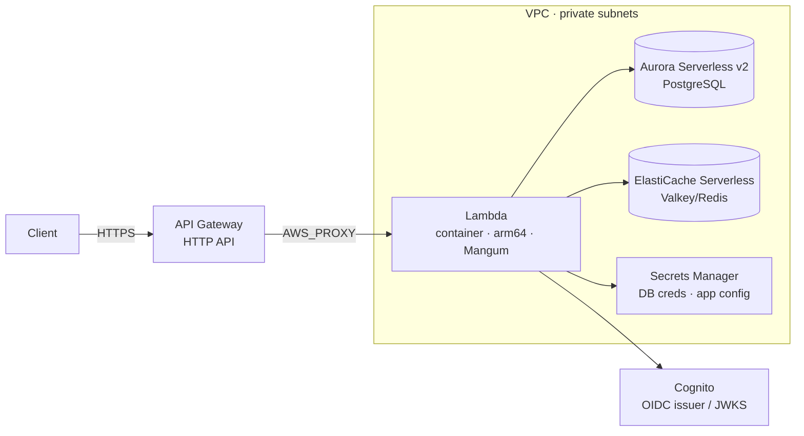
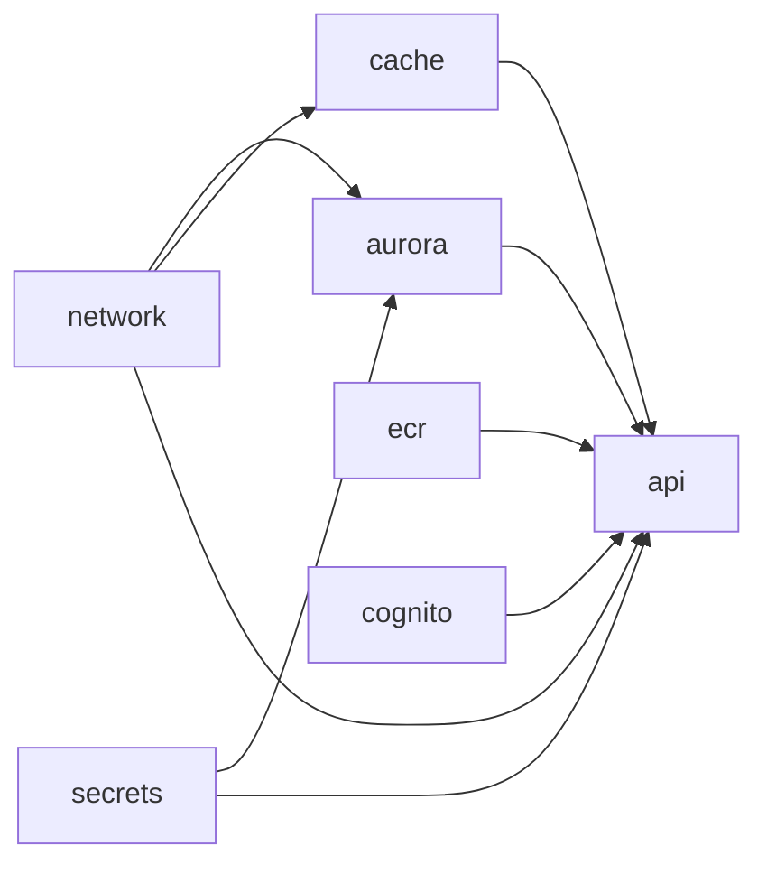

# Infrastructure

The service deploys to AWS as a **full serverless** stack — no always-on servers. It's defined as
Terraform modules composed by **Terragrunt Stacks**, under `infra/`. The canonical reference is
[`infra/README.md`](https://github.com/cjgalvisc96/CJ-FASTAPI-DDD/blob/main/infra/README.md); this page
is the docs-site overview.

## Serverless architecture



The app runs as a **container image on Lambda** (behind Mangum) — the same image built for Docker,
so there's one artifact for local and cloud.

## Modules (`infra/terraform/modules/`)

| Module | Creates |
|---|---|
| `network` | VPC, 2 AZs, public/private subnets, IGW, single NAT (toggle), S3 gateway endpoint, shared app SG |
| `ecr` | ECR repo — scan-on-push, immutable tags, keep-last-10 lifecycle |
| `secrets` | Secrets Manager: DB credentials (`random_password`) + app config |
| `aurora` | Aurora Serverless v2 PostgreSQL, encrypted (customer-managed KMS), private SG (5432 from app SG only) |
| `cache` | ElastiCache Serverless (Valkey), private SG (6379 from app SG only), usage limits |
| `cognito` | Cognito user pool + client + `admin`/`member` groups (serverless-native OIDC) |
| `api` | Lambda (container, arm64/Graviton) in-VPC, least-privilege IAM, HTTP API + `$default` route, bounded log retention |

Each module has `variables.tf`/`main.tf`/`outputs.tf`/`versions.tf`. **Provider blocks live only in
Terragrunt-generated files**, never in the modules.

!!! note "Cognito vs. Keycloak"
    The stack provisions **Cognito** as the serverless-native OIDC IdP, but the app currently ships a
    **Keycloak**-specific verifier (roles from `realm_access.roles`; Cognito uses `cognito:groups`). The
    `api` module takes `oidc_issuer`/`oidc_client_id`/`oidc_jwks_url` as plain variables, so you can
    point it at a Keycloak realm with no code change, or add a small `cognito:groups` claims adapter.

## Terragrunt Stacks (DRY)

Each component's wiring is defined **once** as a reusable **unit template**; each environment is a
single `terragrunt.stack.hcl` that instantiates the 7 units with that env's values.

```
infra/terragrunt/
  root.hcl                        # provider + backend + versions generation, errors{retry}
  units/<component>/terragrunt.hcl  # module source + dependency{mock_outputs} + inputs (defined ONCE)
  dev/   env.hcl + terragrunt.stack.hcl
  prod/  env.hcl + terragrunt.stack.hcl
  local/ env.hcl + terragrunt.stack.hcl   # env.hcl sets use_floci = true (floci)
```

| Concern | Defined once in |
|---|---|
| Provider / backend / versions generation, retry-on-throttle | `root.hcl` |
| A component's module source, dependency graph, mock outputs, inputs | `units/<component>/terragrunt.hcl` |
| Per-env sizing / tags / `use_floci` | `<env>/env.hcl` |
| Which units run + env→unit value mapping | `<env>/terragrunt.stack.hcl` |

Dependency graph (all `dependency` blocks carry `mock_outputs` so `plan` works before apply):



`.terragrunt-stack/` is **generated** (git-ignored) — regenerate with `terragrunt stack generate`,
never edit or commit it.

## Environments

- **`dev` / `prod`** — real AWS. State in **S3 + DynamoDB** (bucket/table must be bootstrapped first;
  see `infra/README.md`). `prod` scales up (Aurora max 8 ACU, one NAT per AZ, `deletion_protection`).
- **`local`** — the whole stack against **[floci](docker.md)** (local AWS emulator) with a **local**
  state backend, no bucket bootstrap. `local/env.hcl` sets `use_floci = true`, so `root.hcl` generates
  a floci-pointed provider (endpoints → `http://localhost:14566`).

## Running

Each env is a stack; the `terragrunt:*` Taskfile targets run `stack generate` then `stack run`:

```bash
task terragrunt:plan   ENV=dev     # generate + init + plan (dev)
task terragrunt:apply  ENV=local   # against floci — run `task floci:up` first
task terragrunt:validate ENV=prod
task terragrunt:trivy              # Trivy IaC misconfig scan (honors infra/.trivyignore)
task terragrunt:fmt
```

!!! warning "Apply is gated through CD"
    Don't `apply` real environments from a laptop. The [CD pipeline](ci.md) plans + scans on every
    infra change; the apply/deploy step is intentionally gated. Local usage is plan/review only.

## Cost-conscious defaults & tagging

Lambda **arm64/Graviton** (~20% cheaper), **HTTP API** (not REST), **single NAT** in dev, **S3 gateway
endpoint** (free), **Aurora min 0.5 ACU**, **ElastiCache usage limits**, **bounded CloudWatch
retention**, **ECR keep-last-10**. Every resource carries the mandatory FinOps tags (`Project`,
`Environment`, `ManagedBy`, `Owner`, `CostCenter`) via the provider's `default_tags` — set per env in
`<env>/env.hcl`. The IaC is scanned by Trivy in CI/CD ([CI](ci.md)); accepted findings live in
`infra/.trivyignore`.
