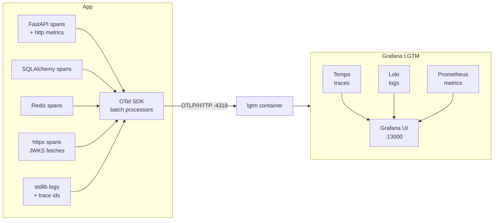

# Telemetry (OpenTelemetry)

The app ships **logs, metrics, and traces** via OpenTelemetry, exported over **OTLP/HTTP** to any
collector. Locally, the "reports" side is the all-in-one **Grafana LGTM** backend (Grafana + Tempo +
Loki + Prometheus with a built-in OTLP collector).



## What is instrumented

The wiring lives in **`src/ddd_app/core/telemetry/`** and is a **no-op unless `OTEL_ENABLE=true`** —
local runs and the test suite need no collector.

| Signal | Source |
| --- | --- |
| **Traces** | FastAPI server spans; SQLAlchemy queries; Redis commands (cache + rate limiter); outbound `httpx` (Keycloak JWKS) — one end-to-end trace per request |
| **Metrics** | `http.server.*` duration/active-request metrics from the ASGI instrumentation, exported periodically |
| **Logs** | Every stdlib log record (app + uvicorn + libraries) shipped as OTel logs, with **`trace_id`/`span_id` injected** for log↔trace correlation |

`setup_telemetry(app, settings)` is called once from the entrypoint (`main.py`), *after*
`create_app()` — app assembly stays transport-pure. The OTLP **HTTP** exporter is used (no compiled
grpcio dependency).

## Running it locally

The LGTM backend is part of the default stack — nothing extra to start:

```bash
task docker:up             # postgres + redis + keycloak + atlas + lgtm + app
```

The compose file points the app at `http://lgtm:4318`, and `.env` ships with `OTEL_ENABLE=true`
(set it to `false` to switch all telemetry off — the code path is a complete no-op).

Open **http://localhost:13000** (login `admin`/`admin`) → *Explore*:

- **Tempo** — search traces for service `cj-fastapi-ddd`; a request shows the route span with its
  SQL, Redis, and JWKS child spans.
- **Loki** — `{service_name="cj-fastapi-ddd"}`; log lines carry the trace id of the request.
- **Prometheus/Mimir** — e.g. `http_server_duration_milliseconds_count` by route.

Settings (`.env`):

```bash
OTEL_ENABLE=true                                   # kill-switch — false makes telemetry a no-op
OTEL_EXPORTER_OTLP_ENDPOINT=http://localhost:14318 # host runs; compose overrides to http://lgtm:4318
OTEL_SERVICE_NAME=cj-fastapi-ddd
```

Host ports follow the project's offset scheme: Grafana **13000**, OTLP gRPC **14317**, OTLP HTTP
**14318** (overridable via `GRAFANA_HOST_PORT` / `OTLP_*_HOST_PORT`).

!!! note "AWS"
    On Lambda, point `OTEL_EXPORTER_OTLP_ENDPOINT` at a collector (e.g. an ADOT sidecar/extension or
    a hosted OTLP endpoint) and set `OTEL_ENABLE=true` via the `api` module's environment. The LGTM
    container is a **local dev** backend, not a production one.

## Testing

`tests/unit/test_telemetry.py` verifies the disabled path is a true no-op (no exporter constructed)
and that the enabled path wires exporters against the configured endpoint and instruments the app —
using fakes, no collector needed. The `core/telemetry/` package is excluded from the coverage gate
(like `main.py`) because its export paths require a live collector.
